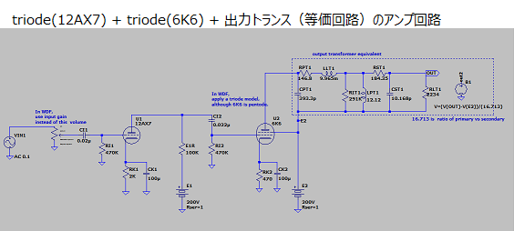
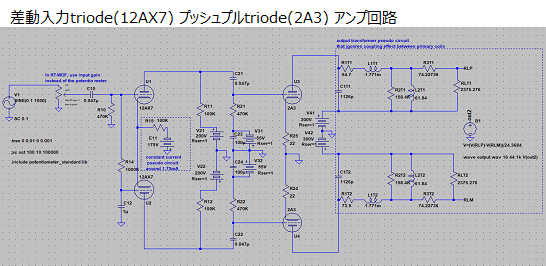
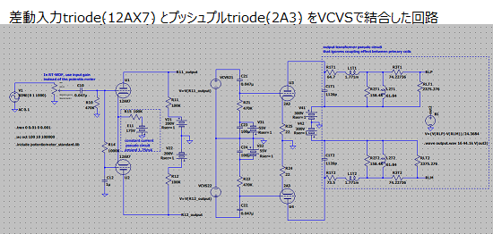

# Wave Digital Filterの勉強

## 概要  

Wave Digital Filterの動作サンプル[rt-wdf_render](https://github.com/RT-WDF/rt-wdf_renderer)を
Windows10 + Visual Studio Community 2017の環境で動かすために変更したもの。  

## 主な変更点  

- stereo (2 channel)入力に対応 source
- 出力ファイル名を変更。   RenderThread.cpp
- CSVファイル出力の無効化。RenderThread.cpp
- Input Gain Controlの有効化。 wdfCCTAx1Tree.hpp wdfCCTAx4Tree.hpp  
- VisualStudio2017の追加。　wdfRenderer.jucer
- triode モデルの6K6　を追加　rt-wdf_lib  
- triode モデルの2A3　を追加　rt-wdf_lib  
- Newton法の反復計算の係数alphaの調整を追加 rt-wdf_lib  
- Resampler機能の削除　必要に応じて外部のResamplerを使うこと
- 表示の大きさの変更
  
armadillo-9.500.2の中のblas_win64_MT.dll lapack_win64_MT.dllを使いました。  

## 主な追加点  

- vcxプロジェクトファイル Builds/VisualStudio2017  
- Fender Bassman tone stackのR-type adaptorのS-Matrixの計算  ToneStack_R-type_S-Matrix_compute  
- 簡単な３極真空管Triodeアンプ回路のS E F M N 各Matrixの計算　Common_Cathode_Triode_Amp_SEFMN-Matrix_compute  
- triode(12AX7) + triode(6K6) + 出力トランス（等価回路）のアンプ回路を追加　wdfTwoTriodeAmpTree.hpp Two_Triode_Amp_SEFMN-Matrix_compute  
- 差動入力triode(12AX7) プッシュプルtriode(2A3) アンプ回路を追加　wdfSadouPushPullTriodeAmpTree.hpp Triode_Sadou_PushPull_Amp_SEFMN-Matrix_compute  
- 差動入力triode(12AX7) とプッシュプルtriode(2A3) をVCVSで結合した回路を追加　wdfSadouPushPushVCVSConnectionTriodeAmpTree.hpp Triode_Sadou_PushPull_VCVS-connect_Amp_SEFMN-Matrix_compute  
- channel毎にwdfを並列計算  openmpを使っているためコンパイラのOpenMPのサポートを有効にすること　RenderThread.cpp

  

   
  

## 参照したもの  

以下を展開したものに変更を加えました。  

- [rt-wdf_render](https://github.com/RT-WDF/rt-wdf_renderer)
- [RT-WDF library](https://github.com/RT-WDF/rt-wdf_lib)
- [JUCE](https://github.com/WeAreROLI/JUCE)
- [Armadillo](http://arma.sourceforge.net/download.html)

以下で公開されている真空管と出力トランスのデータを使いモデルを作成しました。   

- [Ayumi's Lab.](http://ayumi.cava.jp/audio/index.html)

## ライセンス  
GPL v3  
RT-WDF libraryがGPLのため、それに従うことになります。   
Libsディレクトリーの中にある説明文を参照してください。  

## 真空管アンプの入出力波形の例  　

Wave Digital Filterを使ってシュミレーションした真空管アンプ回路CCTA(x4)とJTM45の動作波形の例。  
真空管は非線形素子なのでサンプリング周波数を４倍に上げて計算している。  
JTM45は歪ませる設定(input gain, volume)にしている。  

  
  
  

