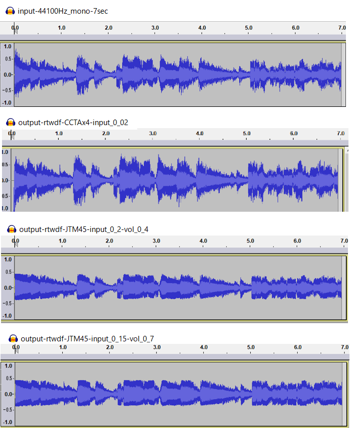

# Wave Digital Filterの勉強

## 概要  

Wave Digital Filterの動作サンプル[rt-wdf_render](https://github.com/RT-WDF/rt-wdf_renderer)を
Windows10 + Visual Studio Community 2017の環境で動かすために変更したもの。 

## 主な変更点  

- 出力ファイル名を変更。   RenderThread.cpp
- CSVファイル出力の無効化。RenderThread.cpp
- Input Gain Controlの有効化。 wdfCCTAx1Tree.hpp wdfCCTAx4Tree.hpp
- downsamplingの無効化。 MainComponent.cpp RenderThread.cpp
- VisualStudio2017の追加。　wdfRenderer.jucer

upsampleして、WDFを計算した後、downsampleすると　プログラムがハングアップするので、
downsampleの方は無効にしました。   
armadillo-9.500.2の中のblas_win64_MT.dll lapack_win64_MT.dllを使いました。  

## 参照したもの  

以下を展開したものに変更を加えました。  

- [rt-wdf_render](https://github.com/RT-WDF/rt-wdf_renderer)
- [RT-WDF library](https://github.com/RT-WDF/rt-wdf_lib)
- [JUCE](https://github.com/WeAreROLI/JUCE)
- [r8brain-free-src](https://github.com/avaneev/r8brain-free-src)
- [Armadillo](http://arma.sourceforge.net/download.html)

## ライセンス  
RT-WDF libraryがGPLのため、それに従うことになります。   
Libsディレクトリーの中にある説明文を参照してください。  

## 真空管アンプの入出力波形　

Wave Digital Filterを使った真空管アンプ回路CCTA(x4)とJTM45の動作波形の例。  
真空管は非線形素子なのでサンプリング周波数を４倍に上げて計算している。  
JTM45は歪ませる設定(input gain, volume)にしている。  

  

